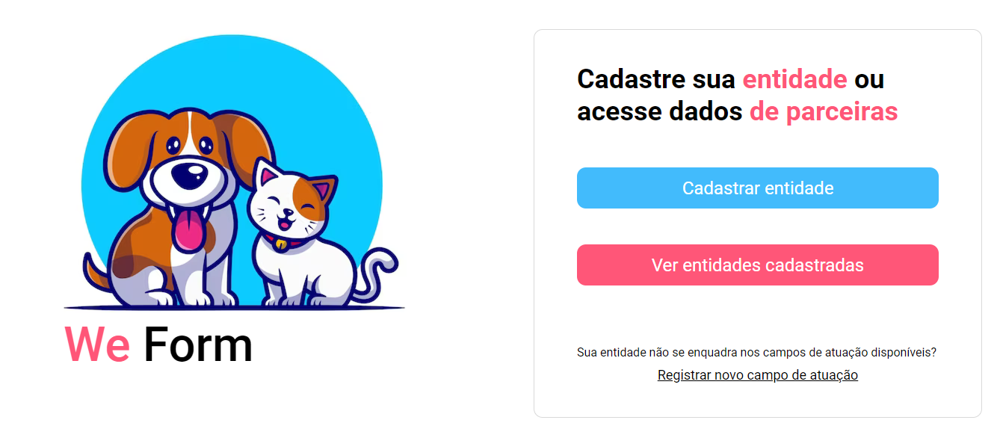
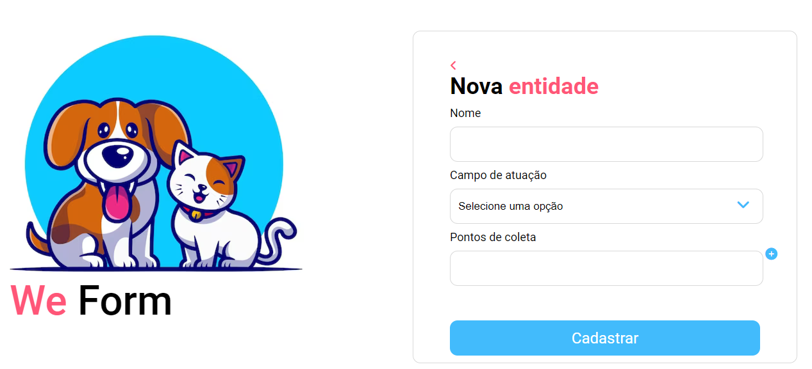
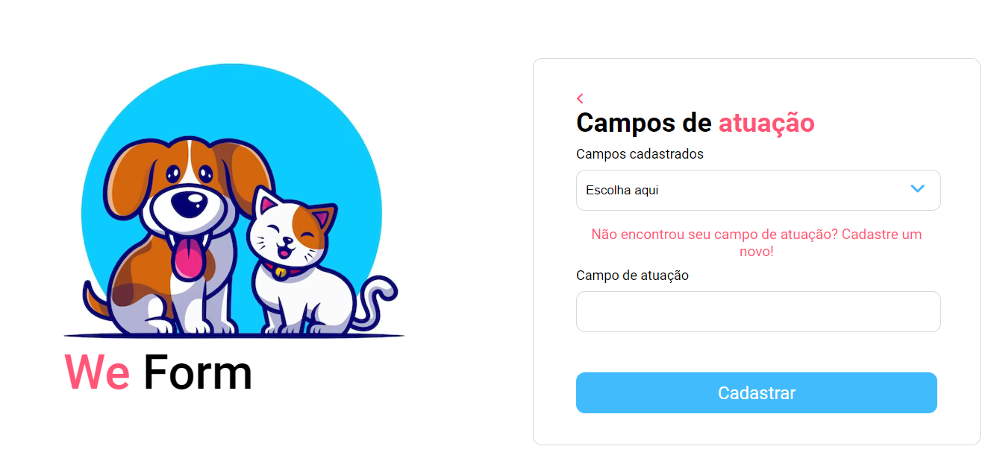
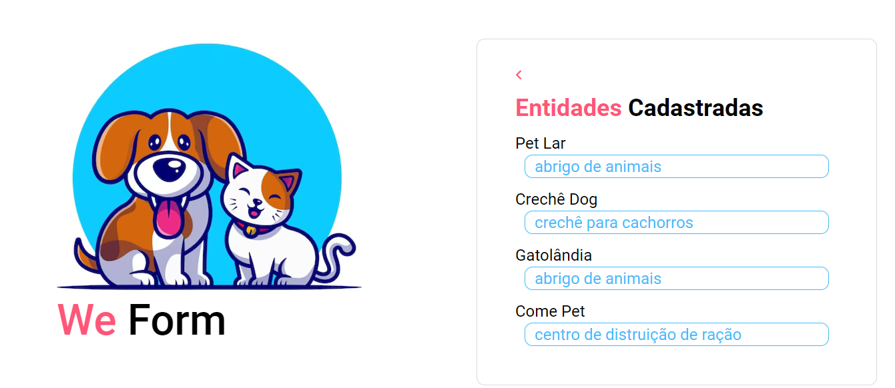

<h1 align="center"> WE FORM </h1>

Desenvolvimento de páginas web para o projeto We Form que faz parte do curso de trilha front-end ministrado pela Ada Tech + Santander Coders. 

 

  <a href="#-tecnologias">Tecnologias</a>&nbsp;&nbsp;&nbsp;|&nbsp;&nbsp;&nbsp;
  <a href="#-projeto">Projeto</a>&nbsp;&nbsp;&nbsp;|&nbsp;&nbsp;&nbsp;
  <a href="#-layout">Layout</a>&nbsp;&nbsp;&nbsp;|&nbsp;&nbsp;&nbsp;
  

  
   

 

## 🚀 Tecnologias

Esse projeto foi desenvolvido com as seguintes tecnologias:

- HTML e CSS
- JavaScript
- Git e Github

## 💻 Projeto

O projeto consiste em quatro paginas web que simulam um site de cadastro para entidades sociais.

- [Acesse o projeto finalizado](https://avafabian.github.io/projeto-ada/)

